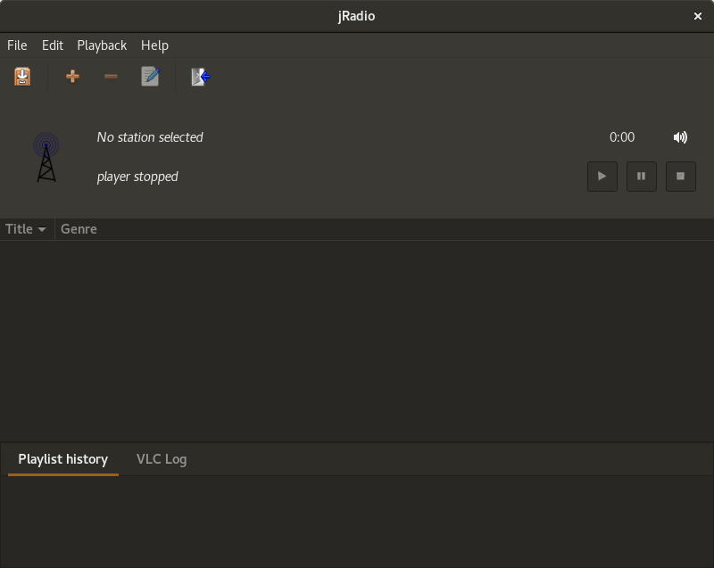
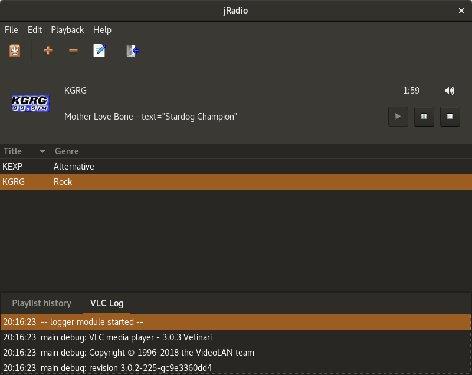
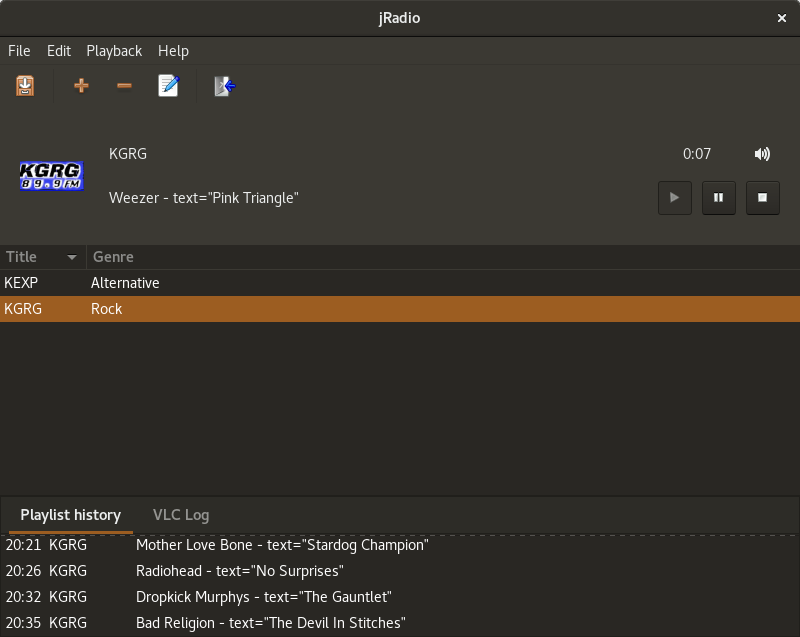
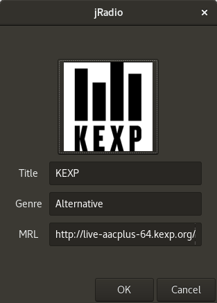

jRadio
======

[](https://opensource.org/licenses/MIT)

An internet radio player for the Linux desktop

jRadio is an easy to use internet radio player for your Linux desktop. The
application is written in C++ using Gtkmm and (among others) includes the
following features:

* Robust playback of web radio streams using VLC
* Meta data support
* Playlist history
* Customizable station icons

### How to Install

To compile the sources use the following commands from the root directory

```shell
autoreconf -vif
./configure [--prefix=PREFIX]
make
```

Afterwards you can install the application into the specified PREFIX directory
by using the command

```shell
make install
```

### Screenshots








